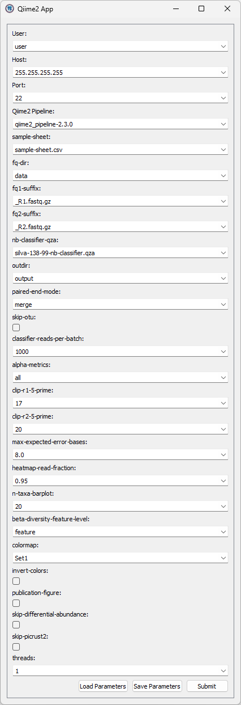

# Qiime2 App



### Server configuration

Create a `~/Qiime2App` in the user's name directory, which is the root directory of the Qiime2App.
A typical directory structure is shown below:

```
~/Qiime2App/
├── .bash_profile
├── fastq/
├── qiime2_pipeline-1.0.0/
├── sample-sheet.csv
└── silva-138-99-nb-classifier.qza
```

The `.bash_profile` defines all things needed to be activated to run the `qiime2_pipeline-1.0.0`.
An example of the `.bash_profile` is shown below:

```bash
source $HOME/anaconda3/bin/activate qiime2-amplicon-2024.2
export QT_QPA_PLATFORM=offscreen
export UNIFRAC_USE_GPU=N
```

Other files/directories are described as follows:

- `fastq/`: Directory containing all fastq files
- `qiime2_pipeline-1.0.0/`: The `qiime2_pipeline` which can be downloaded from [here](https://github.com/linyc74/qiime2_pipeline/releases)
- `sample-sheet.csv`: The sample sheet file required by the `qiime2_pipeline`
- `silva-138-99-nb-classifier.qza`: The classifier file required by the `qiime2_pipeline`
